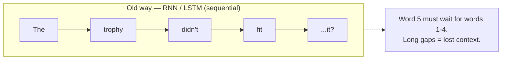
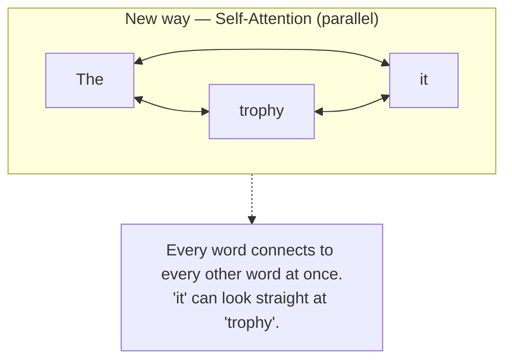
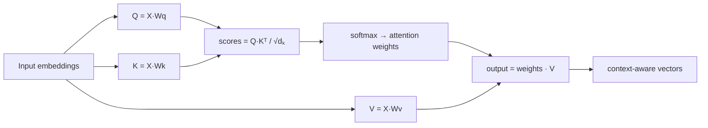
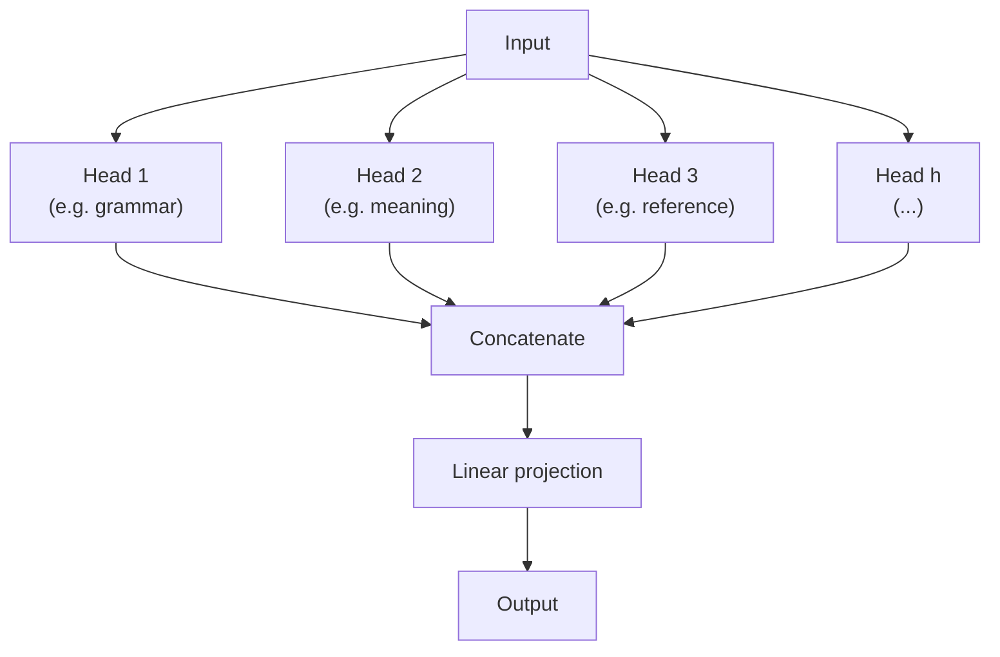
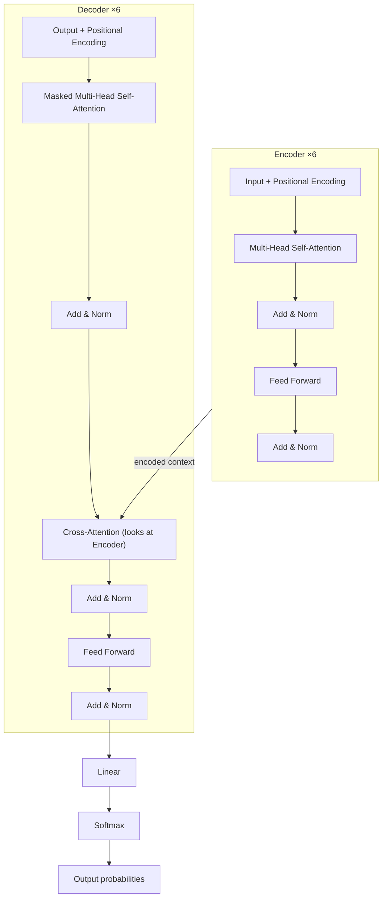
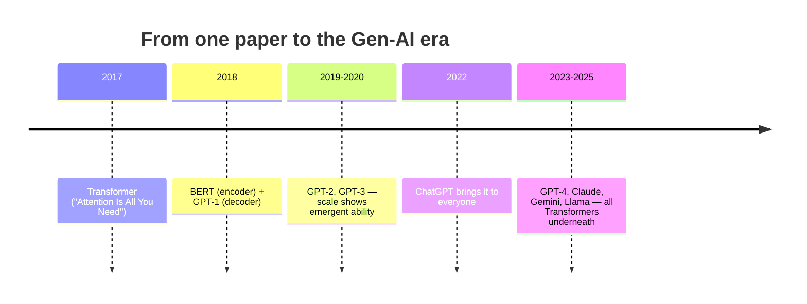

# GEN-AI Research

My deep-dives into the research papers behind modern Generative AI — read end to end, then broken down into plain-English notes with diagrams.

### 📄 Paper covered in this repo

> **Attention Is All You Need** — Vaswani, Shazeer, Parmar, Uszkoreit, Jones, Gomez, Kaiser & Polosukhin · *NeurIPS 2017* · [arXiv:1706.03762](https://arxiv.org/abs/1706.03762)

This is *the* paper that introduced the **Transformer** — the architecture every modern large language model (GPT, Gemini, Claude, BERT) is built on. Everything below is my breakdown of it. The hands-on worked example lives in [`NOTES.md`](NOTES.md).

---

## Attention Is All You Need — a breakdown

I kept seeing "Transformer" everywhere — GPT, Gemini, Claude, BERT, Stable Diffusion's text encoder — and every trail led back to this one 2017 paper from Google. So I sat down and actually read it instead of nodding along. These are the notes I wish I'd had on day one: the intuition first, the math second, and diagrams wherever a picture said it better than a paragraph.

---

## TL;DR

Before this paper, the best language models read text **one word at a time**, in order, like a person reading with a finger on the page. That made them slow to train and forgetful over long sentences.

The Transformer threw that out. It looks at **every word at once** and learns, for each word, *which other words matter to it* — a mechanism called **self-attention**. No recurrence, no convolutions. Just attention.

That one change made models massively parallel to train, much better at long-range context, and — crucially — *scalable*. Scale them up and you get GPT. That's the whole lineage.

---

## The problem it solved

The models of the day (RNNs, LSTMs, GRUs) were **sequential**. To compute the meaning of word #50, you first had to process words #1 through #49, in order. Two consequences:

- **Slow.** You can't parallelise something that depends on its own previous step. Training crawled.
- **Forgetful.** Information from early words had to survive a long chain of updates to reach the end. Long-distance relationships ("The *trophy* didn't fit in the suitcase because **it** was too big") got diluted.



The Transformer's answer: stop passing information down a chain. Let every word look at every other word **directly**, in a single step.



---

## The core idea: self-attention

For every word, the model asks: *"given everything else in this sentence, what should I pay attention to?"* It answers using three vectors derived from each word's embedding:

| Vector | Think of it as | Role |
|--------|----------------|------|
| **Query (Q)** | What I'm looking for | the current word's question |
| **Key (K)** | What I contain | a label other words advertise |
| **Value (V)** | What I'll actually give you | the information passed along if matched |

The mechanism — **Scaled Dot-Product Attention** — is one line:

```
Attention(Q, K, V) = softmax( (Q · Kᵀ) / √dₖ ) · V
```

Read it in plain English:

1. **Q · Kᵀ** — compare each word's query against every word's key. High score = "these two are relevant to each other."
2. **÷ √dₖ** — divide by the square root of the key dimension so the scores don't blow up and wreck the softmax.
3. **softmax** — turn the scores into weights that add up to 1 (a probability distribution over "how much to attend to each word").
4. **× V** — take a weighted blend of every word's value. That blend *is* the new, context-aware representation of the word.



---

## Multi-head attention

One attention calculation captures one *kind* of relationship. But language has many at once — grammar, meaning, reference, tense. So the paper runs attention **several times in parallel** ("heads"), each with its own Q/K/V projections, then concatenates the results.

One head might learn "match pronouns to their nouns," another "link verbs to their subjects." Together they give a richer picture.



---

## Positional encoding

If you look at all words at once, you lose their **order** — and "dog bites man" is not "man bites dog." Since there's no recurrence to track position, the paper *adds* a positional signal to each word embedding, built from sine and cosine waves of different frequencies. Each position gets a unique, smooth fingerprint the model can learn to read.

```
PE(pos, 2i)   = sin(pos / 10000^(2i/d_model))
PE(pos, 2i+1) = cos(pos / 10000^(2i/d_model))
```

---

## The full architecture

The Transformer is an **encoder–decoder** stack (the paper uses 6 layers each). The encoder builds a rich understanding of the input; the decoder generates the output one token at a time, attending both to what it's produced so far and to the encoder's output.



Two details that quietly do a lot of work:

- **Add & Norm** — every sub-layer is wrapped in a residual connection (`x + sublayer(x)`) followed by layer normalization. This is what lets you stack the blocks deep without the gradients dying.
- **Masked attention** in the decoder — during generation, a word isn't allowed to "see" future words (that would be cheating), so future positions are masked out.

---

## Why it mattered

The results were already strong — a new state-of-the-art on English-German translation (**28.4 BLEU** on WMT 2014) at a *fraction* of the training cost of the previous best models. But the headline wasn't the BLEU score. It was that this architecture **scaled**. Pour in more data and more parameters and it just keeps getting better — which is exactly what happened next.



Every large language model you've used is a descendant of this design. BERT is the encoder half; GPT is the decoder half. The "T" in GPT and BERT literally stands for **Transformer**.

---

## My takeaways

- **The big leaps are often a removal, not an addition.** They deleted recurrence — the thing everyone assumed was essential — and the model got better *and* faster.
- **Attention is just a smart weighted average.** Stripped of the notation, "softmax(QKᵀ/√d)·V" is "blend everyone's information, weighted by how relevant they are to you." That clicked for me.
- **Parallelism was the real unlock.** Better long-range context was nice; being able to train on GPUs at massive scale is what made GPT possible.

---

## Read it yourself

- 📄 Paper: [Attention Is All You Need (arXiv:1706.03762)](https://arxiv.org/abs/1706.03762)
- 🧑‍💻 Annotated walk-through with code: [The Annotated Transformer (Harvard NLP)](https://nlp.seas.harvard.edu/annotated-transformer/)
- 🎨 Visual intuition: [The Illustrated Transformer (Jay Alammar)](https://jalammar.github.io/illustrated-transformer/)

---

## Citation

```bibtex
@inproceedings{vaswani2017attention,
  title     = {Attention Is All You Need},
  author    = {Vaswani, Ashish and Shazeer, Noam and Parmar, Niki and
               Uszkoreit, Jakob and Jones, Llion and Gomez, Aidan N. and
               Kaiser, Lukasz and Polosukhin, Illia},
  booktitle = {Advances in Neural Information Processing Systems (NeurIPS)},
  year      = {2017}
}
```

---

*Notes by Maitreyi Gaur. Written while reading the paper end to end — corrections and discussion welcome via issues.*
